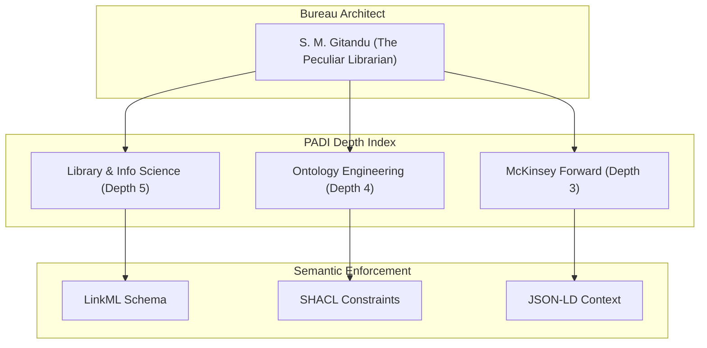

# PADI Authority Control Bureau (v3.0)

## Overview
The **PADI (Practice-Area Depth Index) Authority Control Bureau** is a deterministic information system designed to enforce semantic integrity and eliminate hallucination in Agent-to-Agent (A2A) communications. 

## Semantic Knowledge Graph

## Core Mandate: Constraint Sovereignty
Following the "Librarian’s Mandate," this bureau prioritizes structure and semantic validation over raw data volume. It serves as a "Semantic Firewall".

## Bureau Structure (MECE Architecture)
* **src/**: The "DNA" of the bureau containing the LinkML schema.
* **project/**: The "Law" containing executable artifacts like SHACL shapes.
* **data/**: The "Archive" containing validated records for milestones.
* **docs/**: The "Ledger" containing generated documentation.

## About the Architect
**Samuel Muriithi Gitandu (BS)** is an Information Science professional based in Nairobi, Kenya. He is the Founding Architect of the **Practice-Area Depth Index (PADI)** and is currently participating in the **McKinsey Forward Program**.

---
*Generated by the Sovereign Bureau Local Node.*
