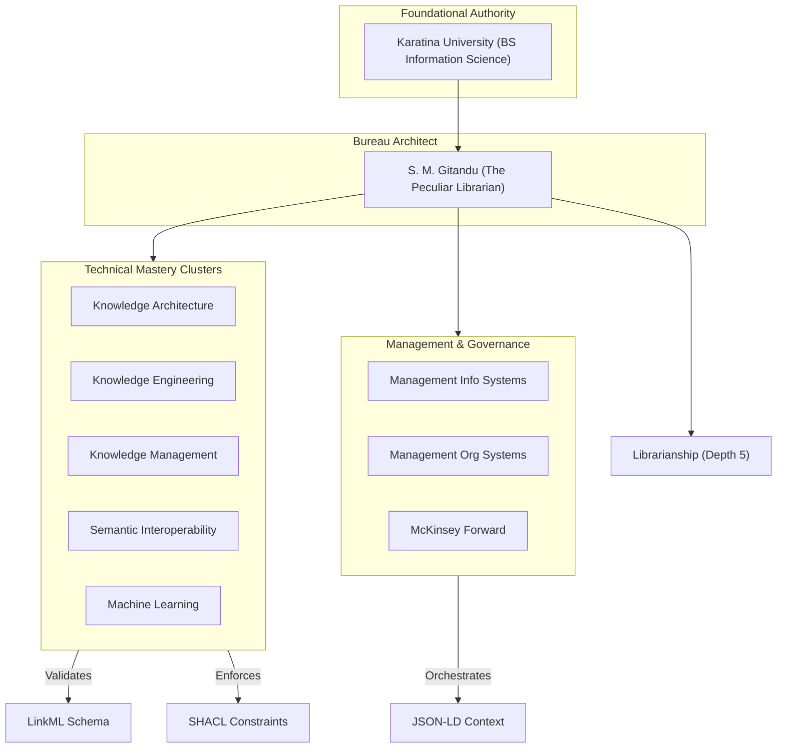

# PADI Authority Control Bureau (v3.0)

## Overview
The **PADI (Practice-Area Depth Index) Authority Control Bureau** is a deterministic information system designed to enforce semantic integrity and eliminate hallucination in Agent-to-Agent (A2A) communications.

## Semantic Knowledge Graph

## Core Mandate: Constraint Sovereignty
Following the "Librarian’s Mandate," this bureau prioritizes structure and semantic validation over raw data volume. It serves as a **Semantic Firewall** to ensure truth in the Sovereign Bureau.

## Bureau Structure (MECE Architecture)
* **src/**: The "DNA" containing the LinkML schema.
* **project/**: The "Law" containing SHACL shapes and JSON-LD contexts.
* **data/**: The "Archive" containing validated records for milestones, hardware (1.5TB), and specialized skills.
* **docs/**: The "Ledger" containing generated documentation.

## About the Architect
**Samuel Muriithi Gitandu (BS)** is an Information Science professional based in Nairobi, Kenya. He is the Founding Architect of **PADI** and a participant in the **McKinsey Forward Program** (ID: 2011217A1).

---
*Generated by the Sovereign Bureau Local Node.*

## Extended Documentation
* See [MANIFESTO.md](./MANIFESTO.md) for the full Architect's Mandate and Bureau Philosophy.
