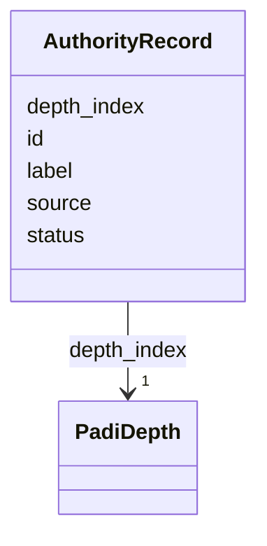

# Class: AuthorityRecord 


URI: [skos:Concept](http://www.w3.org/2004/02/skos/core#Concept)





<!-- no inheritance hierarchy -->

## Class Properties

| Property | Value |
| --- | --- |
| Class URI | [skos:Concept](http://www.w3.org/2004/02/skos/core#Concept) |
| Tree Root | Yes |


## Slots

| Name | Cardinality and Range | Description | Inheritance |
| ---  | --- | --- | --- |
| [id](id.md) | 1 <br/> [String](String.md) |  | direct |
| [label](label.md) | 1 <br/> [String](String.md) |  | direct |
| [depth_index](depth_index.md) | 1 <br/> [PadiDepth](PadiDepth.md) |  | direct |
| [source](source.md) | 0..1 <br/> [String](String.md) |  | direct |
| [status](status.md) | 0..1 <br/> [String](String.md) |  | direct |


## Identifier and Mapping Information


### Schema Source


* from schema: https://github.com/peculiarlibrary/padi-authority-control


## Mappings

| Mapping Type | Mapped Value |
| ---  | ---  |
| self | skos:Concept |
| native | padi:AuthorityRecord |


## LinkML Source

<!-- TODO: investigate https://stackoverflow.com/questions/37606292/how-to-create-tabbed-code-blocks-in-mkdocs-or-sphinx -->

### Direct

<details>
```yaml
name: AuthorityRecord
from_schema: https://github.com/peculiarlibrary/padi-authority-control
attributes:
  id:
    name: id
    from_schema: https://github.com/peculiarlibrary/padi-authority-control
    rank: 1000
    identifier: true
    domain_of:
    - AuthorityRecord
    - BureauAgent
    required: true
  label:
    name: label
    from_schema: https://github.com/peculiarlibrary/padi-authority-control
    rank: 1000
    domain_of:
    - AuthorityRecord
    required: true
  depth_index:
    name: depth_index
    from_schema: https://github.com/peculiarlibrary/padi-authority-control
    rank: 1000
    domain_of:
    - AuthorityRecord
    range: PadiDepth
    required: true
  source:
    name: source
    from_schema: https://github.com/peculiarlibrary/padi-authority-control
    rank: 1000
    domain_of:
    - AuthorityRecord
    range: string
  status:
    name: status
    from_schema: https://github.com/peculiarlibrary/padi-authority-control
    rank: 1000
    domain_of:
    - AuthorityRecord
    range: string
class_uri: skos:Concept
tree_root: true

```
</details>

### Induced

<details>
```yaml
name: AuthorityRecord
from_schema: https://github.com/peculiarlibrary/padi-authority-control
attributes:
  id:
    name: id
    from_schema: https://github.com/peculiarlibrary/padi-authority-control
    rank: 1000
    identifier: true
    alias: id
    owner: AuthorityRecord
    domain_of:
    - AuthorityRecord
    - BureauAgent
  label:
    name: label
    from_schema: https://github.com/peculiarlibrary/padi-authority-control
    rank: 1000
    alias: label
    owner: AuthorityRecord
    domain_of:
    - AuthorityRecord
    required: true
  depth_index:
    name: depth_index
    from_schema: https://github.com/peculiarlibrary/padi-authority-control
    rank: 1000
    alias: depth_index
    owner: AuthorityRecord
    domain_of:
    - AuthorityRecord
    range: PadiDepth
    required: true
  source:
    name: source
    from_schema: https://github.com/peculiarlibrary/padi-authority-control
    rank: 1000
    alias: source
    owner: AuthorityRecord
    domain_of:
    - AuthorityRecord
    range: string
  status:
    name: status
    from_schema: https://github.com/peculiarlibrary/padi-authority-control
    rank: 1000
    alias: status
    owner: AuthorityRecord
    domain_of:
    - AuthorityRecord
    range: string
class_uri: skos:Concept
tree_root: true

```
</details>