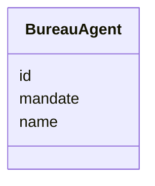

# Class: BureauAgent 


URI: [schema:SoftwareAgent](http://schema.org/SoftwareAgent)





<!-- no inheritance hierarchy -->

## Class Properties

| Property | Value |
| --- | --- |
| Class URI | [schema:SoftwareAgent](http://schema.org/SoftwareAgent) |


## Slots

| Name | Cardinality and Range | Description | Inheritance |
| ---  | --- | --- | --- |
| [id](id.md) | 1 <br/> [String](String.md) |  | direct |
| [name](name.md) | 1 <br/> [String](String.md) |  | direct |
| [mandate](mandate.md) | 0..1 <br/> [String](String.md) |  | direct |


## Identifier and Mapping Information


### Schema Source


* from schema: https://github.com/peculiarlibrary/padi-authority-control


## Mappings

| Mapping Type | Mapped Value |
| ---  | ---  |
| self | schema:SoftwareAgent |
| native | padi:BureauAgent |


## LinkML Source

<!-- TODO: investigate https://stackoverflow.com/questions/37606292/how-to-create-tabbed-code-blocks-in-mkdocs-or-sphinx -->

### Direct

<details>
```yaml
name: BureauAgent
from_schema: https://github.com/peculiarlibrary/padi-authority-control
attributes:
  id:
    name: id
    from_schema: https://github.com/peculiarlibrary/padi-authority-control
    identifier: true
    domain_of:
    - AuthorityRecord
    - BureauAgent
    - OutreachLog
    required: true
  name:
    name: name
    from_schema: https://github.com/peculiarlibrary/padi-authority-control
    rank: 1000
    domain_of:
    - BureauAgent
    required: true
  mandate:
    name: mandate
    from_schema: https://github.com/peculiarlibrary/padi-authority-control
    rank: 1000
    domain_of:
    - BureauAgent
    range: string
class_uri: schema:SoftwareAgent

```
</details>

### Induced

<details>
```yaml
name: BureauAgent
from_schema: https://github.com/peculiarlibrary/padi-authority-control
attributes:
  id:
    name: id
    from_schema: https://github.com/peculiarlibrary/padi-authority-control
    identifier: true
    alias: id
    owner: BureauAgent
    domain_of:
    - AuthorityRecord
    - BureauAgent
    - OutreachLog
    required: true
  name:
    name: name
    from_schema: https://github.com/peculiarlibrary/padi-authority-control
    rank: 1000
    alias: name
    owner: BureauAgent
    domain_of:
    - BureauAgent
    required: true
  mandate:
    name: mandate
    from_schema: https://github.com/peculiarlibrary/padi-authority-control
    rank: 1000
    alias: mandate
    owner: BureauAgent
    domain_of:
    - BureauAgent
    range: string
class_uri: schema:SoftwareAgent

```
</details>