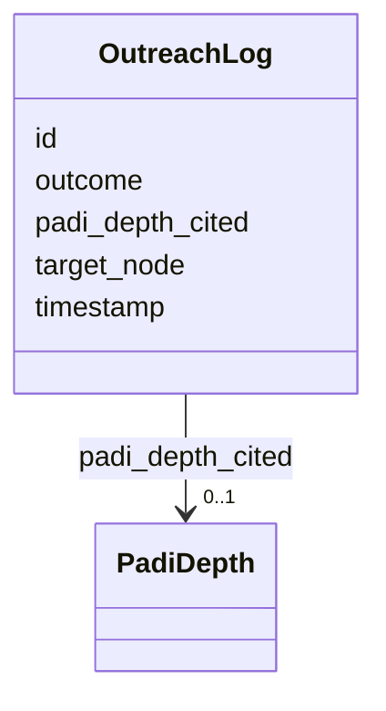

# Class: OutreachLog 


URI: [padi:OutreachLog](https://gitandu.com/padi/OutreachLog)





<!-- no inheritance hierarchy -->

## Slots

| Name | Cardinality and Range | Description | Inheritance |
| ---  | --- | --- | --- |
| [id](id.md) | 1 <br/> [String](String.md) |  | direct |
| [target_node](target_node.md) | 1 <br/> [String](String.md) |  | direct |
| [timestamp](timestamp.md) | 1 <br/> [String](String.md) |  | direct |
| [padi_depth_cited](padi_depth_cited.md) | 0..1 <br/> [PadiDepth](PadiDepth.md) |  | direct |
| [outcome](outcome.md) | 0..1 <br/> [String](String.md) |  | direct |


## Identifier and Mapping Information


### Schema Source


* from schema: https://github.com/peculiarlibrary/padi-authority-control


## Mappings

| Mapping Type | Mapped Value |
| ---  | ---  |
| self | padi:OutreachLog |
| native | padi:OutreachLog |


## LinkML Source

<!-- TODO: investigate https://stackoverflow.com/questions/37606292/how-to-create-tabbed-code-blocks-in-mkdocs-or-sphinx -->

### Direct

<details>
```yaml
name: OutreachLog
from_schema: https://github.com/peculiarlibrary/padi-authority-control
attributes:
  id:
    name: id
    from_schema: https://github.com/peculiarlibrary/padi-authority-control
    identifier: true
    domain_of:
    - AuthorityRecord
    - BureauAgent
    - OutreachLog
    required: true
  target_node:
    name: target_node
    from_schema: https://github.com/peculiarlibrary/padi-authority-control
    rank: 1000
    domain_of:
    - OutreachLog
    required: true
  timestamp:
    name: timestamp
    from_schema: https://github.com/peculiarlibrary/padi-authority-control
    rank: 1000
    domain_of:
    - OutreachLog
    required: true
  padi_depth_cited:
    name: padi_depth_cited
    from_schema: https://github.com/peculiarlibrary/padi-authority-control
    rank: 1000
    domain_of:
    - OutreachLog
    range: PadiDepth
  outcome:
    name: outcome
    from_schema: https://github.com/peculiarlibrary/padi-authority-control
    rank: 1000
    domain_of:
    - OutreachLog
    range: string

```
</details>

### Induced

<details>
```yaml
name: OutreachLog
from_schema: https://github.com/peculiarlibrary/padi-authority-control
attributes:
  id:
    name: id
    from_schema: https://github.com/peculiarlibrary/padi-authority-control
    identifier: true
    alias: id
    owner: OutreachLog
    domain_of:
    - AuthorityRecord
    - BureauAgent
    - OutreachLog
    required: true
  target_node:
    name: target_node
    from_schema: https://github.com/peculiarlibrary/padi-authority-control
    rank: 1000
    alias: target_node
    owner: OutreachLog
    domain_of:
    - OutreachLog
    required: true
  timestamp:
    name: timestamp
    from_schema: https://github.com/peculiarlibrary/padi-authority-control
    rank: 1000
    alias: timestamp
    owner: OutreachLog
    domain_of:
    - OutreachLog
    required: true
  padi_depth_cited:
    name: padi_depth_cited
    from_schema: https://github.com/peculiarlibrary/padi-authority-control
    rank: 1000
    alias: padi_depth_cited
    owner: OutreachLog
    domain_of:
    - OutreachLog
    range: PadiDepth
  outcome:
    name: outcome
    from_schema: https://github.com/peculiarlibrary/padi-authority-control
    rank: 1000
    alias: outcome
    owner: OutreachLog
    domain_of:
    - OutreachLog
    range: string

```
</details>